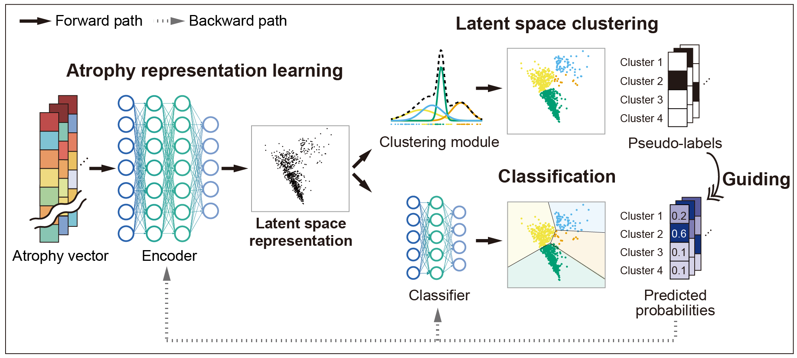

# DebaNet

This repository contains the code and data associated with the publication:

**[Disentangling brain atrophy heterogeneity in Alzheimer's disease: A deep self-supervised approach with interpretable latent space](https://doi.org/10.1016/j.neuroimage.2024.120737)**

Authors: Sohyun Kang, Sung-Woo Kim, Joon-Kyung Seong

Published in: *Neuroimage*, 2024

## Table of Contents

- [Introduction](#introduction)
- [Installation](#installation)
- [Usage](#usage)
- [Repository Structure](#repository-structure)
- [Citation](#citation)
- [License](#license)
- [Acknowledgments](#acknowledgments)
- [Contact](#contact)

## Introduction

### Overview

This repository contains the code for our deep self-supervised learning framework to disentangle heterogeneous features of brain atrophy in Alzheimer's Disease patients. Based on the clustering-based deep self-supervised learning framework by Caron et al. (2018), our method integrates atrophy feature extraction, clustering, and classification into an end-to-end learning process.

### Framework Steps

1. **Atrophy Representation Learning**:
   - An encoder compresses original atrophy vectors into latent representations.

2. **Latent Space Clustering**:
   - A clustering module groups these latent representations and assigns pseudo-labels.

3. **Classification**:
   - A classifier predicts the labels. By minimizing the cross-entropy loss between pseudo-labels and predicted probabilities, the encoder and classifier are refined, improving the latent representations.

### Benefits

- Simultaneous atrophy feature extraction, clustering, and classification.
- Effective disentanglement of disease heterogeneity into key dimensions, progreesion and subtypes, in the latent space.
