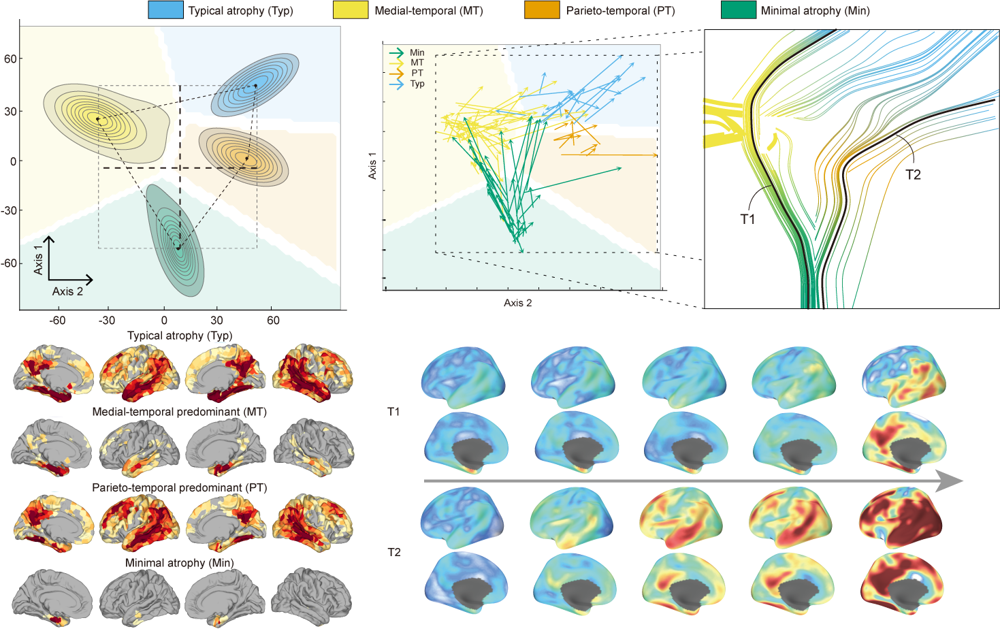

# DecoNet: disentangling heterogeneity in latent space by self-supervised framework

This repository contains the code and data associated with the publication:

**[Disentangling brain atrophy heterogeneity in Alzheimer's disease: A deep self-supervised approach with interpretable latent space](https://doi.org/10.1016/j.neuroimage.2024.120737)**

Authors: Sohyun Kang, Sung-Woo Kim, Joon-Kyung Seong

Published in: *Neuroimage*, 2024



## Table of Contents

- [Introduction](#introduction)
- [Installation](#installation)
- [Usage](#usage)
- [Repository Structure](#repository-structure)
- [Citation](#citation)
- [License](#license)
- [Acknowledgments](#acknowledgments)
- [Contact](#contact)

## Introduction

### Overview

This repository contains the code for our deep self-supervised learning framework to disentangle heterogeneous features of brain atrophy in Alzheimer's Disease patients. Based on the clustering-based deep self-supervised learning framework by Caron et al. (2018), our method integrates atrophy feature extraction, clustering, and classification into an end-to-end learning process.

### Framework Steps

1. **Atrophy Representation Learning**:
   - An encoder compresses original atrophy vectors into latent representations.

2. **Latent Space Clustering**:
   - A clustering module groups these latent representations and assigns pseudo-labels.

3. **Classification**:
   - A classifier predicts the labels. By minimizing the cross-entropy loss between pseudo-labels and predicted probabilities, the encoder and classifier are refined, improving the latent representations.

### Benefits

- Simultaneous atrophy feature extraction, clustering, and classification.
- Effective disentanglement of disease heterogeneity into key dimensions, progreesion and subtypes, in the latent space.

## Installation

1. **Clone the repository**:

    ```bash
    git clone https://github.com/SohyunKang/DebaNet.git
    cd DebaNet
    ```

2. **Install the required packages**:

    ```bash
    pip install -r requirements.txt
    ```

## Usage

To run the main analysis:

```bash
python src/main_script.py
```

## Repository Structure
- `data/`: Data files
- `final/`: Final model
- `img/`: Project overview images
- `src/`: Source code
- `README.md`: Project documentation

## Citation
If you use this code or dataset in your research, please cite the following publication:

```scss
@article{kang2024disentangling,
  title={Disentangling brain atrophy heterogeneity in Alzheimer's disease: a deep self-supervised approach with interpretable latent space},
  author={Kang, Sohyun and Kim, Sung-Woo and Seong, Joon-Kyung and Alzheimer's Disease Neuroimaging Initiative and others},
  journal={NeuroImage},
  pages={120737},
  year={2024},
  publisher={Elsevier}
}
```

## License
GNU GENERAL PUBLIC LICENSE
Version 3, 29 June 2007

Copyright (C) 2024 Sohyun Kang

Everyone is permitted to copy and distribute verbatim copies
of this license document, but changing it is not allowed.

Preamble

The GNU General Public License is a free, copyleft license for
software and other kinds of works.

The licenses for most software and other practical works are designed
to take away your freedom to share and change the works. By contrast,
the GNU General Public License is intended to guarantee your freedom to
share and change all versions of a program--to make sure it remains free
software for all its users. We, the Free Software Foundation, use the
GNU General Public License for most of our software; it applies also to
any other work released this way by its authors. You can apply it to
your programs, too.

For the full license text, please see: <https://www.gnu.org/licenses/gpl-3.0.html>

## Acknowledgments
Funding sources
Collaborators
Contributors

## Contact
For questions or issues, please contact:

Sohyun Kang - fjqmfl5676@korea.ac.kr
